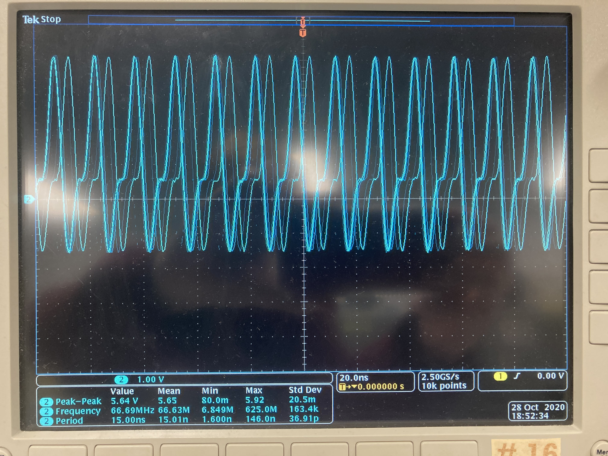

### pwm
I could never get the frequency of the pwm to be exactly 50Mhz. With __delay_cycles(1), it resulted in a 40Mhz frequency, though it was very consisteny. Voltages were all the same, though the period did slightly jitter here and there. For the most part it was very consistent though. With __delay_cycles(0), I got a frequency of 66.6ish Mhz, but this was much more varied than the __delay_cycles(1) was. It jumped from 66.0 to 67Mhz, and was very fuzzy. Std Dev for this was about 163.4kHz

